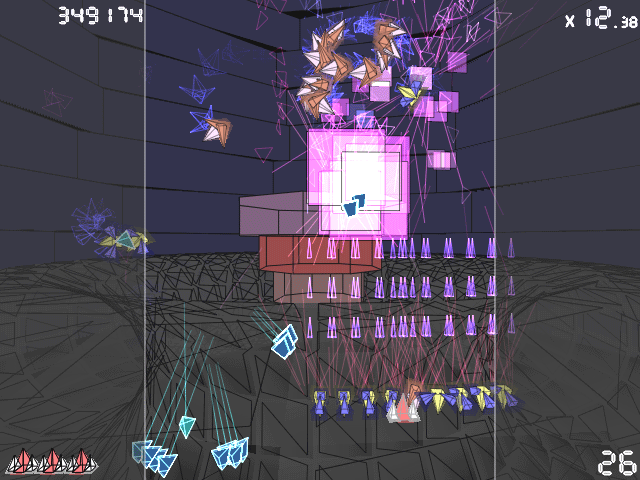

# Titanion

Strike down super high-velocity swooping insects. Fixed shooter in the good old days, 'Titanion'.

## About this Port

This is a C++ conversion of the [original game](https://www.asahi-net.or.jp/~cs8k-cyu/windows/ttn_e.html) by Kenta Cho that was written in the D programming language. There might be bugs. But so far it looks good.

The motivation for this port to C++ is to make it more accessible.

Contributions are welcome!

### Compile&Run

Install `SDL-devel`, `SDL_mixer-devel` and `glu-devel`, then run `make`. This will create a self contained `titanion` binary to run.

## How to play

Avoid incoming bullets and strike down all enemies. At the title screen, you can select a game mode (CLASSIC, BASIC, MODERN).

* **CLASSIC mode**
  * Sporadic firing.
  * Use a capture beam to make a friend of an enemy.
  * When your ship collides against an enemy, your ship is destroyed.
* **BASIC mode**
  * Middle course.
  * You can use the capture beam anytime.
  * When your ship collides against an enemy, your ship is knocked away.
* **MODERN mode**
  * Bullet hell.
  * Use a provocation beam to force an enemy to fire more bullets and earn a bullet multiplier bonus.
  * When your ship collides against an enemy, nothing happens. Your ship and an enemy go through each other.

## Controls

* **Move** - Arrow / Num / [WASD] / [IJKL] / Stick
  * Move your ship.
* **Shot** - [Z][L-Ctrl][R-Ctrl][.] / Button 1, 3, 5, 7, 9, 11  
   Hold down a button to fire automatically.
  * **MODERN mode**  
    Hold a provocation beam button at the same time to slow down speed of your ship and fire intensively.
* **Capture beam / Provocation beam** - [X][L-Alt][R-Alt][L-Shift][R-Shift][/][Return] / Button 2, 4, 6, 8, 10, 12
  * **CLASSIC mode - Capture beam**  
    You can capture enemies with the capture beam. To fire the capture beam, a capture beam energy (displayed in the left panel) should be full. The capture beam energy increased when you destroy an enemy. Captured enemies are lined up beside the player and counterattack to other enemies. Your ship is invincible when you are firing the capture beam.
  * **BASIC mode - Capture beam**  
    You can use the capture beam anytime, but your ship isn't invincible while firing.
  * **MODERN mode - Provocation beam**  
    The provocation beam forces an enemy to fire more bullets and you can earn more bullet multiplier bonus. You have to release the shot button to fire the provocation beam.

## Multiplier

A score multiplier is displayed in the upper right. It increases when you destroy a enemy and decreases slowly when the enemy is on the screen.

### Proximity multiplier

* **BASIC mode**  
  When you destroy an enemy at close range, you can get a proximity multiplier (Max x16).

### Bullet multiplier

* **MODERN mode**  
  When you destroy a pink midsize enemy, bullets flying side-by-side are changed into a bullet multiplier in a chain reaction. Use the provocation beam to the midsize enemy to get higher bonus.

## Extra ship

* **CLASSIC mode**  
  You earn an extra ship every 100,000 points.

* **BASIC mode**  
  You earn an extra ship every 1,000,000 points.

* **MODERN mode**  
  A score to earn the next extra ship is displayed in the upper left.
